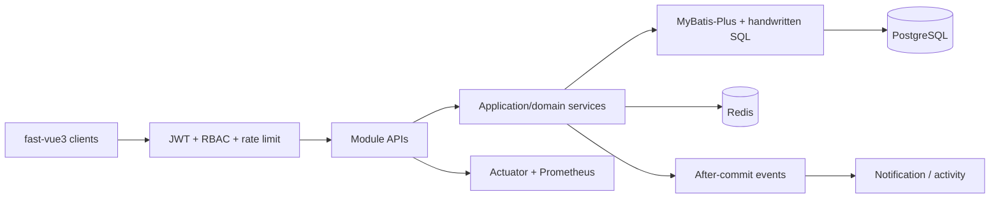
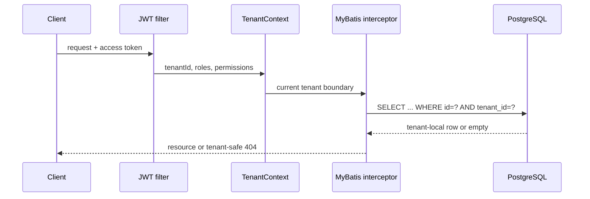
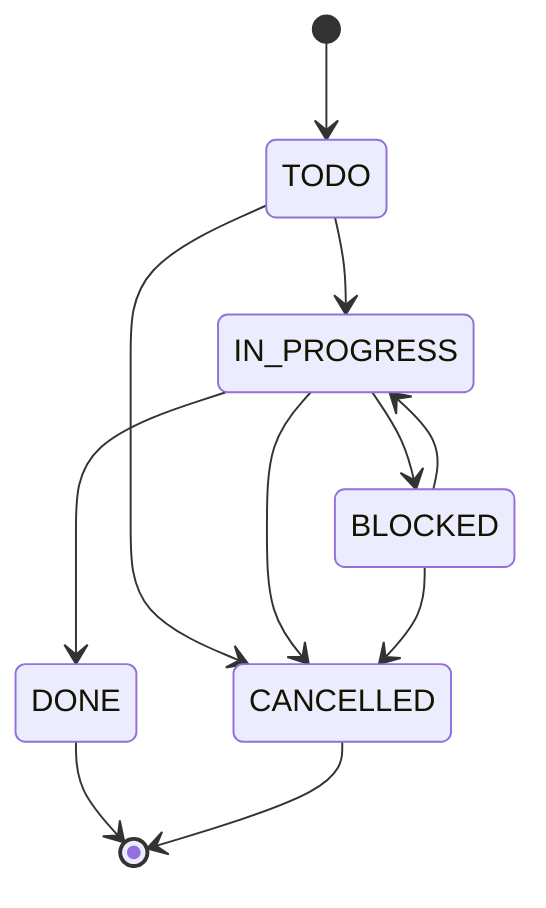
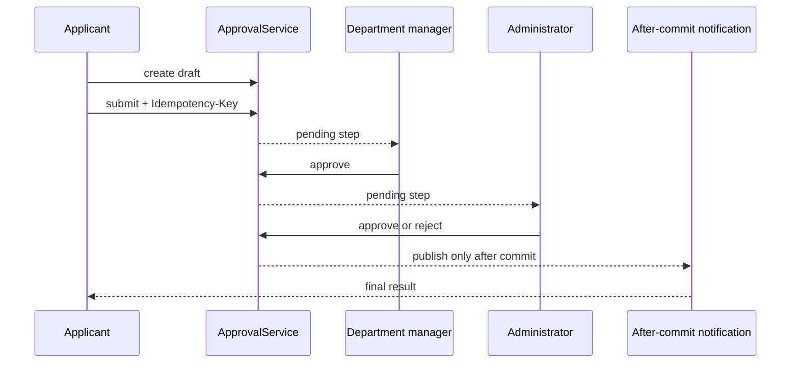

# fast-vue3-server

**Languages:** English | [简体中文](./README.zh-CN.md) | [繁體中文（台灣）](./README.zh-TW.md) | [繁體中文（香港）](./README.zh-HK.md) | [日本語](./README.ja.md)

The official Spring Boot reference backend for [fast-vue3](https://github.com/tobe-fe-dalao/fast-vue3). It is a Java 21 modular monolith that provides one `/api/v1` contract for all admin and site applications.

Documentation: <https://tobe-fe-dalao.github.io/fast-vue3-site/en/server/>

## Stack

- Spring Boot 3 / Spring MVC / Spring Security
- JWT access and refresh tokens
- MyBatis-Plus and PostgreSQL
- Redis refresh-token storage, permission cache, rate limiting, and idempotency
- Flyway migrations
- Springdoc OpenAPI
- JUnit 5, MockMvc, and Testcontainers

## Modules

```text
com.fastvue
├── common          # Response envelope, errors, exception handling
├── config          # Persistence, OpenAPI, initialization
├── infrastructure  # Audit fields and entity base
├── security        # JWT and Spring Security
└── module
    ├── auth, user, role, permission, menu
    ├── tenant, organization, project, task
    ├── approval, notification, audit
    ├── content, analytics, portal
    └── site        # Blog comments and payment checkout
```

## Architecture

The application is deployed as one Spring Boot process, while business capabilities remain isolated as vertical modules. HTTP APIs depend on services; services own authorization, transactions, and state transitions; mappers own persistence. PostgreSQL is the source of truth and Redis is used only where short-lived coordination or high-frequency reads justify it.



### Module design

- `tenant` and `organization` establish the enterprise boundary and department tree.
- `project` and `task` demonstrate membership access, business state, comments, activity history, soft archival, and optimistic locking.
- `approval` is a deliberately small state machine, not a BPMN engine.
- `notification` consumes in-process events only after the database transaction commits.
- `audit` stores request metadata separately from project/task business activity.
- `infrastructure` contains tenant enforcement, idempotency, metrics, request correlation, and file-storage abstractions.

## Multi-tenant architecture

`tenantId` is loaded from the signed access token into `TenantContext`. A MyBatis tenant interceptor automatically appends tenant predicates to protected tables and supplies the tenant column on inserts. Ordinary tenant administrators cannot disable this rule. Only the bootstrap system administrator (user 1 in the default tenant, with the `admin` role) enters the explicit cross-tenant path. Anonymous `/api/v1/public/**` requests resolve the tenant from `X-Tenant-Code` (default: `default`), so public tenant data follows the same boundary.



Tenant-scoped unique constraints include `(tenant_id, username)`, `(tenant_id, role code)`, `(tenant_id, department code)`, and `(tenant_id, project code)`. The Testcontainers suite proves that changing a URL ID cannot read another tenant's user.

## Project and task domain

Project access requires membership (except the system super administrator). The creator becomes owner and member atomically. Archived projects reject new tasks and membership changes. Task assignees must already belong to the project. Project removal is represented by archival rather than physical deletion.



Each task activity records actor, time, action, field, previous value, and new value. Completed or cancelled tasks cannot be reopened or have critical fields silently rewritten.

## Approval workflow

Approval requests use explicit `DRAFT`, `PENDING`, `APPROVED`, `REJECTED`, and `CANCELLED` states. The reference budget flow creates a department-manager step followed by an administrator step. Controllers never manipulate state directly.



Illegal transitions such as `APPROVED -> PENDING` and `REJECTED -> APPROVED` return HTTP 409.

## Transaction, concurrency, and idempotency

- Project/task changes and their activity rows share one transaction.
- Project, task, and approval aggregates carry a `version`; stale updates return HTTP 409 instead of overwriting newer data.
- `POST /api/v1/projects` and `POST /api/v1/approvals/{id}/submit` require `Idempotency-Key` and claim it atomically in Redis for 24 hours.
- Application events are handled with `@TransactionalEventListener(AFTER_COMMIT)`, so rolled-back writes do not send notifications.

## Security

- JWT access and refresh tokens have distinct purposes; refresh tokens cannot authenticate API requests and are atomically rotated in Redis.
- DTOs whitelist mutable fields; entities are never accepted as request bodies.
- Tenant predicates plus project membership checks defend against IDOR and tenant escape.
- File storage uses tenant directories, generated names, normalized paths, size/MIME/extension/signature checks, and an abstraction suitable for future S3/OSS/MinIO adapters.
- Operation audit never stores request bodies, passwords, access tokens, or refresh tokens.
- Production must supply JWT/admin/database secrets, restrictive CORS settings, TLS/reverse proxying, Redis authentication/network controls, backups, and an external object store when local disk is not durable.
- The `prod` profile requires `JWT_SECRET` and `ADMIN_PASSWORD` at startup; the bundled Compose profile uses development settings only.

## Observability

Every API response includes `X-Request-Id`; request logs capture `requestId`, `tenantId`, and `userId`. Actuator exposes health and authenticated metrics/Prometheus endpoints. Standard HTTP/server/Hikari metrics are complemented by:

- `project_created_total`
- `task_created_total`
- `approval_submitted_total`
- `approval_rejected_total`

Prometheus endpoint: `GET /actuator/prometheus`.

## Run locally

For local Java development, install JDK 21 and Docker.

```bash
cp .env.example .env # first run only
docker compose up -d
./mvnw spring-boot:run
```

Without a local JDK, run everything with Docker Desktop or OrbStack. Both expose the same Docker Compose CLI:

```bash
docker compose --profile app up -d --build
docker compose ps
docker compose logs -f app
```

- API: `http://localhost:8080`
- Health: `http://localhost:8080/actuator/health`
- Swagger UI (switches both UI controls and API content between Chinese, Japanese, and English): `http://localhost:8080/swagger-ui.html`
- Direct language selection: `/api-docs-ui/index.html?lang=zh-CN`, `?lang=ja-JP`, or `?lang=en-US`
- OpenAPI JSON: `http://localhost:8080/v3/api-docs/zh-CN`, `/ja-JP`, or `/en-US`
- Development login: `admin / admin123`

## Connect fast-vue3

```bash
cd /Users/fong/Workspace/personal/frontend/vue/fast-vue3/fast-vue3
VITE_DEV_BACKEND=server pnpm dev:web-antd
# or
VITE_DEV_BACKEND=server pnpm dev:site-antd
```

The frontend keeps `/api/v1` as its base path; shared Vite configuration proxies it to this server.

## Response contract

```json
{ "code": 0, "message": "success", "data": {} }
```

Pagination uses:

```json
{ "items": [], "page": 1, "pageSize": 20, "total": 0 }
```

## Authentication boundary

Public authentication endpoints:

- `POST /api/v1/auth/login`
- `POST /api/v1/auth/register`
- `POST /api/v1/auth/refresh`

Login and registration accept an optional `tenantCode`; new tenants are provisioned by the system administrator with an organization, isolated tenant-admin role, role grants, menus, and an initial administrator account.

Public site content:

- `GET /api/v1/public/home|product|features|about|docs|faq|pricing`
- `GET /api/v1/public/blog`
- `GET /api/v1/public/blog/{id}`
- `GET /api/v1/public/blog/{id}/comments`
- `POST /api/v1/public/contact`

Authenticated site interactions:

- `POST /api/v1/blog/{id}/comments`
- `POST /api/v1/payments/checkout`

All management and content-management endpoints require an access token, followed by method-level RBAC checks where applicable.

Operating-data endpoints additionally require `analytics:view` or `data:view`. `GET /api/v1/menus` intentionally needs only login because it returns the current user's own navigation; the management tree and menu CRUD retain `menu:*` permissions. Public handlers do not call the throwing `SecurityUtils.currentUser()` API.

## Payment design

Checkout accepts a payable `planId` and `channel` (`alipay`, `wechat`, or `card`), persists a pending order, and returns an order number, amount, expiry time, and `checkoutUrl`. The bundled adapter never charges real money. A production integration should replace the demo URL with a provider session and verify signed, idempotent callbacks before marking an order paid.

## Persistence

Flyway owns the schema. `V7__site_interactions.sql` adds `site_blog_comment` and `site_payment_order`. Both tables record the authenticated user and common audit fields.

## Tests

```bash
./mvnw test
```

- Unit tests cover authentication, RBAC, project rules, task state transitions, optimistic locking, approval state, idempotency, and project access.
- MockMvc tests verify response contracts and anonymous/authenticated boundaries.
- Testcontainers runs all Flyway migrations against PostgreSQL and proves cross-tenant isolation when Docker is available.

For the full release-quality lifecycle:

```bash
./mvnw clean verify
```

## Documentation

Architecture, setup, configuration, testing, and API reference documentation is maintained centrally in [fast-vue3-site](https://tobe-fe-dalao.github.io/fast-vue3-site/en/server/). This repository intentionally keeps only concise operational guidance in its README and does not include a Node.js/VitePress toolchain.

## License

[MIT](./LICENSE)
