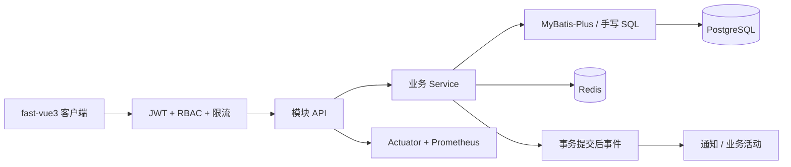
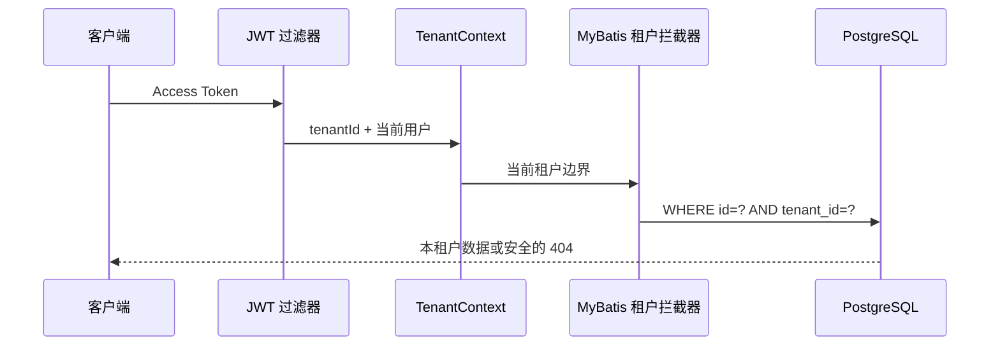
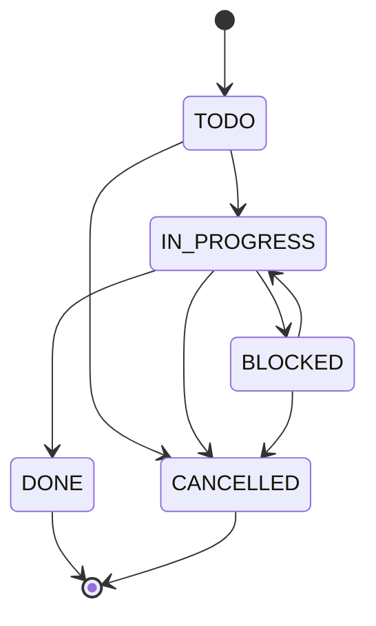
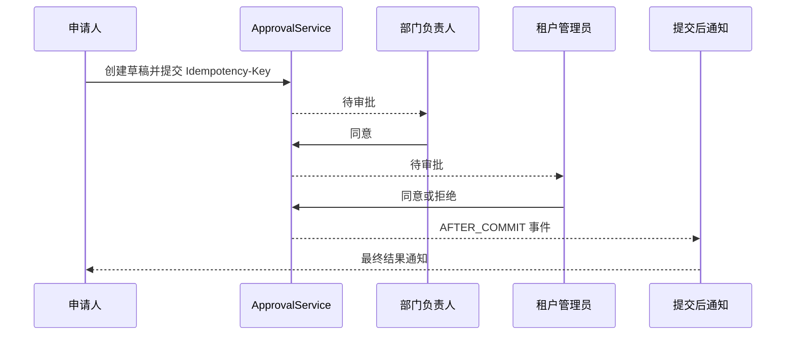

# fast-vue3-server

**语言：** [English](./README.md) | 简体中文 | [繁體中文（台灣）](./README.zh-TW.md) | [繁體中文（香港）](./README.zh-HK.md) | [日本語](./README.ja.md)

[fast-vue3](https://github.com/tobe-fe-dalao/fast-vue3) 的官方参考后端服务。

在线文档：<https://tobe-fe-dalao.github.io/fast-vue3-site/zh/server/>

一个现代、清晰、易维护的 **模块化单体（Modular Monolith）** Spring Boot 项目，为 fast-vue3 提供多租户、组织、项目任务、审批、通知和 RBAC 参考实现。它保持单体部署和明确的业务边界，便于运行、维护和前端对接。

## 技术栈

| 类别 | 选型 |
|---|---|
| 语言 / 运行时 | Java 21 |
| 框架 | Spring Boot 3.x（Spring MVC） |
| 安全 | Spring Security + JWT（Access + Refresh） |
| ORM | MyBatis-Plus（复杂查询自行写 SQL） |
| 数据库 | PostgreSQL |
| 缓存 | Redis（Refresh Token、权限缓存、限流、幂等） |
| 迁移 | Flyway |
| 对象转换 | MapStruct |
| 简化样板 | Lombok |
| 文档 | Springdoc OpenAPI / Swagger UI |
| 构建 | Maven（含 Maven Wrapper） |
| 容器 | Docker + Docker Compose |
| 测试 | JUnit 5 + Spring Boot Test + Testcontainers |

## 架构说明

项目采用 **按业务模块纵向切分** 的模块化单体，而非全局的 `controller / service / mapper / entity` 横向分层。

```
com.fastvue
├── common/
│   ├── response/      # ApiResponse / PageResponse
│   └── exception/     # 错误码、业务异常、全局异常处理
├── config/            # MyBatis-Plus / Jackson / OpenAPI / 管理员初始化 等配置
├── infrastructure/
│   ├── persistence/   # BaseEntity（审计字段）、审计自动填充
│   ├── tenant/        # 租户上下文和公开接口租户解析
│   ├── storage/       # FileStorage 抽象与本地实现
│   └── idempotency/   # Redis 幂等请求声明
├── security/          # JWT、认证过滤器、SecurityConfig、当前用户上下文、RefreshToken 存储
└── module/            # 业务模块；模块内部统一分为 api / service / persistence
    ├── auth/
    ├── user/
    ├── role/
    ├── permission/
    ├── menu/
    ├── tenant/organization/
    ├── project/task/
    └── approval/notification/audit/
```

### 模块示例（user）

```
module/user/
├── api/
│   ├── UserController.java
│   ├── CreateUserRequest.java
│   ├── UpdateUserRequest.java
│   ├── UserQueryRequest.java
│   └── UserVO.java
├── service/
│   ├── UserService.java
│   └── UserConverter.java
└── persistence/
    ├── UserEntity.java
    └── UserMapper.java
```

### 设计原则

- `api` 只处理 HTTP 契约，`service` 处理业务，`persistence` 处理数据访问，**Controller 不直接调用 Mapper**。
- DTO 优先使用 Java 21 `record`，使用 Jakarta Validation 校验。
- 不把 Entity 暴露到 Controller 层，通过 MapStruct 转换为 VO。
- 没有 BaseController / BaseService / 大量自定义通用父类，避免过度抽象。
- 统一响应 `ApiResponse` 与分页 `PageResponse`，全局异常处理 `@RestControllerAdvice`。

## 企业业务架构

服务仍以一个 Spring Boot 进程部署，各业务能力按纵向模块隔离。Controller 只负责 HTTP 契约，Service 负责权限、事务和状态机，Mapper 负责持久化；PostgreSQL 是事实来源，Redis 只用于确有价值的短期协调与高频读取。



### 多租户隔离

登录请求通过 `tenantCode` 选择租户，签名后的 Access/Refresh Token 携带 `tenantId`。认证过滤器把租户写入 `TenantContext`，MyBatis 租户拦截器自动为受保护表追加 `tenant_id` 条件。只有默认租户的初始系统管理员（用户 1，持有 `admin` 角色）可以进入跨租户路径；普通 `tenant-admin` 仍受本租户限制。匿名 `/api/v1/public/**` 使用 `X-Tenant-Code`，缺省为 `default`。



系统管理员创建租户时会在同一事务内开通 Organization、隔离的 `tenant-admin` 角色、权限/菜单关联和初始管理员账号。租户停用或到期后，登录、刷新令牌和已有 Access Token 都不能继续访问。

### Project / Task 业务域

项目创建者自动成为 Owner 和成员。非项目成员不能访问项目或创建任务；负责人必须是项目成员；归档项目不能新增任务或变更成员；项目采用归档而非物理删除。Project、Task 都使用 `version` 乐观锁，过期写入明确返回 HTTP 409。



TaskActivity 记录操作者、时间、动作、字段、旧值和新值；评论、指派和状态变更与业务写入处于同一事务。

### 审批、事件和通知

审批状态为 `DRAFT / PENDING / APPROVED / REJECTED / CANCELLED`。参考流程固定为部门负责人后接租户管理员，不引入 BPMN 引擎。状态转换只存在于 Service，非法转换返回 409。



- `POST /api/v1/projects` 和审批提交使用 Redis `SET NX` 形式的分布式幂等声明。
- Notification 在 `@TransactionalEventListener(AFTER_COMMIT)` 中创建，回滚事务不会提前发通知。
- OperationLog 只保存请求元数据，不记录请求体、密码或 Token；Project/Task Activity 独立保存业务语义。
- 日志关联字段为 `requestId / tenantId / userId`，Prometheus 同时暴露 HTTP、Hikari 和业务计数指标。
- 文件上传通过 `FileStorage` 抽象限制大小、MIME、扩展名和文件签名，并阻止路径穿越。

## 项目目录

```
fast-vue3-server/
├── pom.xml
├── mvnw / mvnw.cmd / .mvn/wrapper/     # Maven Wrapper
├── Dockerfile
├── compose.yml
├── .env.example
├── README.md
└── src/
    ├── main/java/com/fastvue/
    └── main/resources/
        ├── application.yml
        ├── application-dev.yml
        ├── application-prod.yml
        └── db/migration/
            ├── V1__init_schema.sql
            ├── V2__init_permissions.sql
            ├── V3__init_admin.sql
            └── V9__enterprise_domains.sql  # V4-V8 保持原有迁移顺序
```

## 本地运行

### 前置条件

- JDK 21
- Docker（用于启动 PostgreSQL 与 Redis）

### 1. 启动基础设施

```bash
docker compose up -d
```

等待 PostgreSQL 和 Redis 变为 healthy：

```bash
docker compose ps
```

### 2. 启动应用

```bash
./mvnw spring-boot:run
```

应用默认监听 `http://localhost:8080`，启动时自动执行 Flyway 迁移并初始化默认管理员。

可用健康检查确认后端已就绪：

```bash
curl http://localhost:8080/actuator/health
# {"status":"UP"}
```

## Docker Compose

Docker Desktop 与 OrbStack 都提供兼容的 `docker compose` 命令；以下完整容器模式不需要本机安装 Java。

`compose.yml` 默认启动 PostgreSQL 与 Redis：

```bash
docker compose up -d
```

如需连同应用一起以容器方式运行：

```bash
docker compose --profile app up -d --build
docker compose ps
```

这种方式只需 Docker，本机无需安装 JDK 21。查看启动日志：

```bash
docker compose --profile app logs -f app
```

## 环境变量

| 变量 | 说明 | 默认值（dev） |
|---|---|---|
| `DATABASE_URL` | PostgreSQL JDBC 地址 | `jdbc:postgresql://localhost:5432/fastvue3` |
| `DATABASE_USERNAME` | 数据库用户名 | `fastvue3` |
| `DATABASE_PASSWORD` | 数据库密码 | `fastvue3` |
| `REDIS_HOST` | Redis 地址 | `localhost` |
| `REDIS_PORT` | Redis 端口 | `6379` |
| `CORS_ALLOWED_ORIGIN_PATTERNS` | 允许的前端来源（逗号分隔） | `http://localhost:*` |
| `JWT_SECRET` | JWT 签名密钥（≥32 字节） | 见 `application.yml`（**生产必须替换**） |
| `ADMIN_PASSWORD` | 默认管理员密码 | 未设置且为 dev 时回退 `admin123` |

敏感配置一律通过环境变量读取，源码不硬编码生产密码。
`prod` profile 启动时强制要求 `JWT_SECRET` 与 `ADMIN_PASSWORD`；仓库内 Compose 的 `app` profile 仅用于开发环境。

## Swagger 地址

启动后访问：

- Swagger UI（页面控件和接口内容可同步切换中文 / 日本語 / English）：<http://localhost:8080/swagger-ui.html>
- 指定页面语言：`/api-docs-ui/index.html?lang=zh-CN`、`?lang=ja-JP`、`?lang=en-US`
- 中文 OpenAPI JSON：<http://localhost:8080/v3/api-docs/zh-CN>
- 日文 OpenAPI JSON：<http://localhost:8080/v3/api-docs/ja-JP>
- 英文 OpenAPI JSON：<http://localhost:8080/v3/api-docs/en-US>
- 健康检查：<http://localhost:8080/actuator/health>

Swagger UI 已配置 Bearer Token 安全方案、参数说明和通用错误响应。登录后粘贴 Access Token 即可调试需要认证的接口；公开接口不会要求 Token。

## 文档

架构、快速开始、配置部署、测试策略与接口契约统一维护在 [fast-vue3-site](https://tobe-fe-dalao.github.io/fast-vue3-site/zh/server/)。本仓库只保留必要的运行说明和 Swagger/OpenAPI 实时接口，不再包含 Node.js/VitePress 工具链。

## 默认开发管理员

- 用户名：`admin`
- 密码：dev 环境默认 `admin123`（可通过 `ADMIN_PASSWORD` 覆盖；**生产必须显式配置**）

密码使用 BCrypt 加密存储，不保存明文。

## API 说明

统一响应信封：

```json
{ "code": 0, "message": "success", "data": {} }
```

统一分页：

```json
{ "code": 0, "message": "success", "data": { "items": [], "page": 1, "pageSize": 20, "total": 100 } }
```

### 认证

| 方法 | 路径 | 说明 |
|---|---|---|
| POST | `/api/v1/auth/login` | 按 `tenantCode` 登录，返回 accessToken / refreshToken / expiresIn |
| POST | `/api/v1/auth/register` | 按 `tenantCode` 注册普通用户（公开接口） |
| POST | `/api/v1/auth/logout` | 登出（撤销 Refresh Token） |
| POST | `/api/v1/auth/refresh` | 刷新令牌（轮换） |
| GET | `/api/v1/auth/me` | 当前用户信息（含角色与权限） |

登录成功响应：

```json
{
  "code": 0,
  "message": "success",
  "data": {
    "accessToken": "...",
    "refreshToken": "...",
    "expiresIn": 7200
  }
}
```

`GET /api/v1/auth/me` 响应：

```json
{
  "code": 0,
  "message": "success",
  "data": {
    "id": 1,
    "tenantId": 1,
    "username": "admin",
    "nickname": "Administrator",
    "roles": ["admin"],
    "permissions": ["user:list", "user:create", "role:list"]
  }
}
```

### RBAC 资源接口

| 模块 | 方法 | 路径 | 权限 |
|---|---|---|---|
| 用户 | GET | `/api/v1/users` | `user:list` |
| 用户 | POST | `/api/v1/users` | `user:create` |
| 用户 | PUT | `/api/v1/users/{id}` | `user:update` |
| 用户 | DELETE | `/api/v1/users/{id}` | `user:delete` |
| 角色 | GET | `/api/v1/roles` | `role:list` |
| 角色 | POST | `/api/v1/roles` | `role:create` |
| 角色 | PUT | `/api/v1/roles/{id}` | `role:update` |
| 角色 | DELETE | `/api/v1/roles/{id}` | `role:delete` |
| 权限 | GET | `/api/v1/permissions` | `role:list` |
| 菜单 | GET | `/api/v1/menus` | 当前用户菜单树 |
| 菜单 | GET | `/api/v1/menus/tree` | `menu:list` |

菜单字段：`id / parentId / name / path / component / icon / sort / visible / permission / type`，`type` 取值 `directory / menu / button`，支持树形结构。

## 数据库迁移

使用 Flyway，迁移脚本位于 `src/main/resources/db/migration/`：

- `V1__init_schema.sql` — 基础表结构（`sys_user / sys_role / sys_permission / sys_menu` 及关联表）
- `V2__init_permissions.sql` — 权限字符串与菜单初始化
- `V3__init_admin.sql` — 默认管理员与角色绑定

应用启动时自动执行，无需手动干预。

## 测试方式

```bash
./mvnw test            # 单元 + 切片测试（无需 Docker）
./mvnw clean package   # 完整构建（含全部测试）
```

测试分层：

- **单元测试**（Mockito）：登录成功 / 失败、Refresh Token 校验等。
- **切片测试**（`@WebMvcTest`）：验证 `@PreAuthorize` 的 401 / 403 / 放行行为。
- **集成测试**（Testcontainers PostgreSQL）：用户 CRUD 全链路。未安装 Docker 时自动跳过（`disabledWithoutDocker`）。

## 对接 fast-vue3 前端

前端通过 `VITE_APP_API_BASEURL` 切换数据源：

- **Mock 模式**（默认）：`VITE_APP_API_BASEURL=/api/v1`，由 Nitro Mock 服务响应。
- **真实后端模式**：`VITE_APP_API_BASEURL=http://localhost:8080/api/v1`。

两端统一使用 `{ code: 0, message, data }` 响应信封与 `/api/v1/*` 路径前缀，切换时无需改动业务代码。
